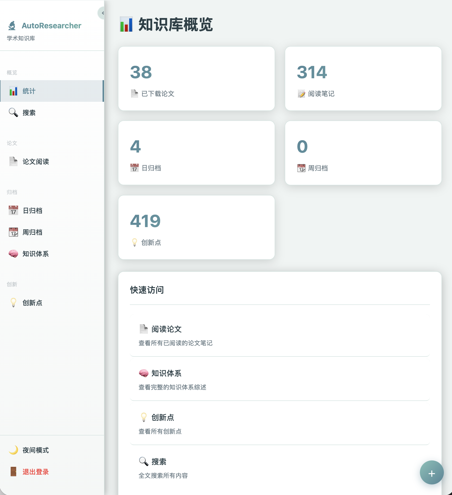

# simple-auto-researcher 🦐
---
### 简单自动科研 | 一只虾的学术野心
> <font color="red">**论文读不完啦**☹️！**诶**🤓**我有一计**🤪！</font><br>
> *科研狗的救星来啦，快push你的小虾米吧～*
> 
**openclaw** + **MiniMax Coding Plan** = 🤯

Alias:
* "AutoResearcher"
* "autoresearcher"
* "ar"

--- 

## 1. 项目简介 🌟

autoresearcher 是一个**全自动学术研究助手**，核心理念是：**"搜→下→读→归档→想点子→验证"** 🔄，半条龙服务，躺平式科研体验！

> 科研狗的痛：我太难了，我不想手动找论文……
> 
> 答：那就让虾来帮你搬砖 🦐

本项目是 [Minimax Coding Plan](https://minimaxi.com)（现在叫 **Token Plan** ✨）的实战案例，用血泪教训趟出来的自动化科研工作流。

### 前置准备（劝退指数：⭐⭐⭐）

- ✅ **必须**：安装 [openclaw](https://github.com/openclaw/openclaw)，配置好 Minimax 环境
- ⚠️ **较难**：mcp环境，使用的是acpx，用来解决minimax的联网搜索。依赖 `acpx opencode exec`（🦞的核心指令），需要下载安装 opencode + 配置 Minimax API 密钥（这一整步卡死过不少人 😢）
- 🌍 **可选**：本地浏览器、tavily、brave api等。⚠️注意，由于任务是isolated沙箱环境，所有main agent的workspace下的skill好像都不太能用。有解决办法敲我～

---

## 2. 配置顺序（手把手 📖）

| 步骤 | 配置项 | 文件 | 备注 |
|------|--------|------|------|
| 1 | 目录设置 | `PATHS.md` | 📁 项目根目录和小龙虾目录|
| 2 | 研究方向 | `DIRECTIONS.md` | 🔬 你研究啥 |
| 3 | 偏好设置 | `PREFERENCES.md` | ⚙️ 联网搜索偏好、论文偏好、论文要求、研究方向分类维度、创新点模板、消息通知、工作量设置等 |
| 4 | 综述模板 | `GUIDELINES.md` | 📝 rethink 怎么写才像论文，好好自己修改哦 |

> 💡 **小贴士**：以上每一步都可以让 openclaw agent 帮你改，say 个 "帮我改 xxx" 就行。后续版本可以让安装后小龙虾自动提醒。

---
## 3. 你需要准备的工作目录
### 📁 工作目录应该有的项目结构

```
AutoResearcher/                  # "AutoResearcher项目根目录"
├── papers.md                    # 论文总库（所有论文元信息汇总）
├── README.md                    # 项目说明
├── files/
│   ├── downloaded/YYYY-MM-DD/   # 已下载论文 PDF + 阅读笔记
│   └── tobedownloaded/          # 待下载论文记录（MD格式）
├── notes/
│   ├── YYYY-MM-DD/*.md          # 论文阅读笔记（按日期分离）
├── knowledgeOutput/
│   ├── daily/                   # 日归档（同日累计，异日分离）
│       └── daily_YYYY-MM-DD.md
│   ├── weekly/                  # 周归档（同月累计，异月分离）
│       └── weekly_YYYY-MM.md
│   ├── rethink.md               # 知识体系构建（上限10万字）
│   └── bak/                     # 备份（最多5份）
├── idea/
│   ├── all/                     # 待验证创新点
│   ├── viewer/                  # 验证记录
│   ├── deprecated/              # 废弃创新点
│   └── idea_*.md                # 已验证创新点
├── logs/
│   ├── search/                  # 搜索记录（同日累计，异日分离）
│       └── search_YYYY-MM-DD.md
│   ├── download/                # 下载记录
│       └── download_YYYY-MM-DD.md
│   └── read/                    # 已读论文列表
│       └── read_YYYY-MM-DD.md
```
---

## 4. 最后 🦐

祝各位：

- 多发 paper 🚀
- 少掉头发 🙏
- 科研顺利，不再头秃 💢

一只虾的学术野心，从这里开始 🦐✨（本README由🦐帮我润色，嘻嘻）

## 4. 可以使用小龙虾给这个系统写个前后端哦
示例如下

晚些开源web。

## 5.后续更新计划，随缘更新。
|编号   |状态  |类别   |目录  |
|------|------|------|------|
|1 |☐| bug|笔记存放位置与论文下载日期一致，此版本好像总是容易放错。| 
|2| ☑| bug|创新点编号，可能已经解决，希望大家体验后给点建议。比如扫描最大编号的时候，没有递归遍历idea整个目录。|
|3|☐|功能|与1一起，增加笔记核对功能|
|4|☐|功能|论文看完要不要删掉呢？|
|5|解决了?|功能|PREFERENCES.md里自定义联网规则|
|6|☐|bug|添加任务，自行进行异常检查，目前已知的有创新点文件命名、创新点审查文件名称一一对应问题，命名与内容的对应。|
|7|☐|功能|虽然写了可以根据skill的配置首次配置后不用配置，但还是加一个手动更新功能，方便修改文件，实现自定义化（其实用户可以自己直接改skill）|
|8|❌|功能|翻译成英文skill，期待有负责人心的大神|
|9|☐|bug|搜索下载任务，搜索下载的前提是论文downloaded都处理完了，总是会出现“貔貅“现象|
|10|☐|bug|为了查看论文的情况，实际上要多和工作目录的papers.md做联动，当前经常出现各个数量对应不上|
|11|☐|bug|所谓的创新点验证，给你们的导师看看吧，我心里也没数|

